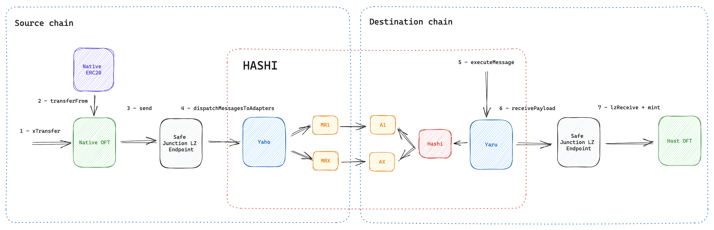

# Safe Junction Core Contracts (xERC20)


[](https://github.com/safe-junction/sj-core-contracts/blob/main/LICENSE)



## Overview

Safe Junction changes the perspective of bridges by positioning itself on a higher level, aiming to provide a universal cross-chain experience by using multiple oracles for compounded security and being faster than others thanks to its Fast Lane feature.

Unlike traditional bridging solutions, Safe Junction leverages the functionality of existing bridges, using them as oracles to authenticate, verify and execute cross-chain operations as instructed by users on different blockchains. By using several bridges as oracles, Safe Junction achieves cross-chain asset transfer validations in a redundant, universal and safer way. It is designed to be chain agnostic and simple to audit. Yet, it achieves speed, thanks to a built-in optional feature called the Fast Lane.

Today the bridging ecosystem suffers from excessive fragmentation. Safe Junction powers *Tokens (“Star Tokens”) to tackle this very problem. These tokens inherit the properties described above to provide a superior cross-chain experience.

In the worst case, the system's speed is equivalent to that of the slowest oracle in the network. However, when the Fast Lane functionality gets used, it overcomes this drawback and enables much higher speed: market makers can process cross-chain transfers in advance, providing their liquidity in response to a user request, and then securely reclaim the liquidity (plus a service fee) once all oracles have processed the cross-chain request at their standard speed.

It is important to understand how Safe Junction differs from existing cross-chain solutions (bridges, aggregators, etc.) in terms of security (which is additive), speed (via Fast Lane MM intervention) and compatibility (as it aims to be 100% agnostic, and not just EVM compatible).

&nbsp;

***

&nbsp;

## How it works

1. **Deploy xERC20 Contracts**: Start by deploying xERC20 contracts as outlined in the [xERC20 documentation](https://docs.connext.network/usecases/xerc20).
   
2. **Obtain xERC20 Token**: For a specific token, acquire the corresponding xERC20 token on the native chain by locking the native token in the xERC20 Lockbox.

3. **Use SJRouter for Cross-Chain Actions**: Leverage SJRouter contracts and their `xTransfer` function for cross-chain minting/burning. This function burns the chosen amount of tokens and uses Hashi to send a cross-chain message containing all necessary parameters for calculating the xERC20 token address on the destination chain.

4. **Message Dispatch Through Hashi**: Hashi dispatches the message to all the selected adapters.

5. **Message Processing by Bridges**: Each bridge involved processes the message and stores the message hash in their respective adapters.

6. **Execution of Hashi Message**: After all bridges have processed the message, Hashi executes the message.

7. **Final Minting Process**: Once the message is executed, the host SJRouter trustlessly calculates the xERC20 token address and proceeds to mint the designated quantity of xERC20 tokens. Additionally, there's a provision where a Market Maker might offer an advance on the tokens to the user, for a fee. This service is particularly useful for users who prefer immediate token access, bypassing the waiting period required for all bridges to process the message.


&nbsp;

***

&nbsp;

## Installation and Usage

### Prerequisites

Ensure you have [Node.js](https://nodejs.org/) and [npm](https://www.npmjs.com/) installed.

### Clone the Repository

```bash
git clone https://github.com/safe-junction/sj-core-contracts.git
cd sj-core-contracts
```

### Install Dependencies

```bash
npm install
```

### Compile Contracts

```bash
npm run compile
```

&nbsp;

***

&nbsp;

## Testing

Before running the tests, make sure you've set up the required environment variables.

```bash
npm run test
```

&nbsp;

***

&nbsp;

## Contribution

Pull requests are welcome. For major changes, please open an issue first to discuss what you would like to change.

&nbsp;

***

&nbsp;

## License

This project is licensed under the TODO License - see the [LICENSE](LICENSE) file for details.


&nbsp;

***

&nbsp;
## Contact

For any inquiries, issues, or feedback, please [raise an issue on GitHub](https://github.com/safe-junction/sj-core-contracts/issues) or contact the team through our [official website](#).

&nbsp;

***

&nbsp;

## ⚠️ Security and Development Disclaimer

All contracts in this repository are still under active development. Although Safe Junction endeavors to ensure the highest level of security and reliability, the evolving nature of software development means that these contracts may contain unforeseen issues or vulnerabilities.

While we strive to provide a secure and robust platform through the integration of multiple oracles and other advanced features, it's crucial for users, developers, and integrators to understand the inherent risks associated with smart contracts and blockchain protocols.

All contracts have undergone thorough testing and reviews, but this doesn't guarantee they are free from errors or security vulnerabilities. Use them at your own risk.